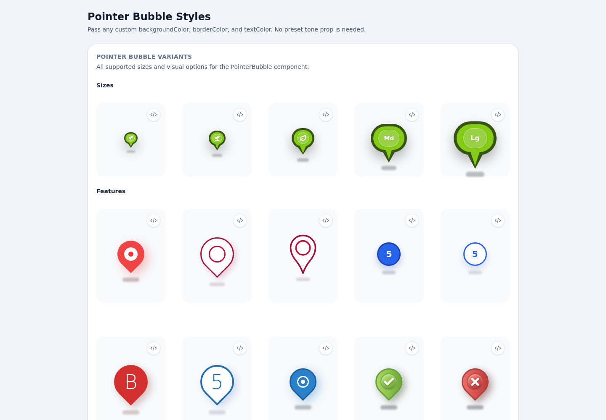
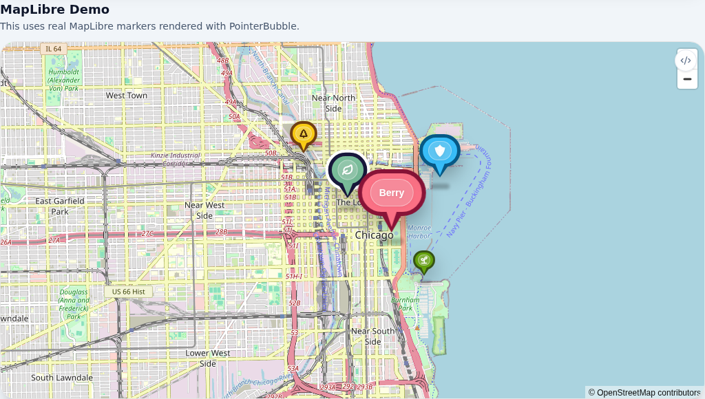

# @moyarich/pointer-bubble

Customizable React pointer bubbles for map markers, labels, annotations, tooltips, and callouts.

`PointerBubble` provides a lightweight visual marker with configurable sizing, colors, pointer tips, shadows, selection states, pulses, custom content, and styling hooks.

## Playground

Live demo: https://moyarich.github.io/pointer-bubble/



## Installation

```sh
npm install @moyarich/pointer-bubble
```

Import the stylesheet once in your application:

```tsx
import "@moyarich/pointer-bubble/styles.css";
```

## Quick Start

```tsx
import { PointerBubble } from "@moyarich/pointer-bubble";
import "@moyarich/pointer-bubble/styles.css";

export function LocationMarker() {
  return (
    <PointerBubble
      size="sm"
      backgroundColor="#79bd9a"
      borderColor="#18173b"
      role="img"
      aria-label="Oak tree location"
    >
      Oak
    </PointerBubble>
  );
}
```

## Features

- Five built-in sizes
- Custom bubble, border, text, and content colors
- Optional pointer tip
- Ground shadow
- Selected state and selection ring
- Animated selection pulse
- Custom React content
- Per-element styling hooks
- Standard `div` attributes and refs
- Reduced-motion support
- Map-library agnostic marker content

## Real MapLibre Example

`PointerBubble` can be mounted directly into a MapLibre marker element using a React root.



```tsx
import React from "react";
import { createRoot } from "react-dom/client";
import maplibregl from "maplibre-gl";
import "maplibre-gl/dist/maplibre-gl.css";
import { PointerBubble } from "@moyarich/pointer-bubble";
import "@moyarich/pointer-bubble/styles.css";

const pins = [
  { label: "Mint", lng: -87.631, lat: 41.883, color: "#79bd9a" },
  { label: "Oak", lng: -87.642, lat: 41.891, color: "#facc15" },
  { label: "Lake", lng: -87.608, lat: 41.887, color: "#38bdf8" },
];

export function MapLibrePins() {
  const containerRef = React.useRef<HTMLDivElement>(null);

  React.useEffect(() => {
    if (!containerRef.current) return;

    const map = new maplibregl.Map({
      container: containerRef.current,
      style: {
        version: 8,
        sources: {
          osm: {
            type: "raster",
            tiles: ["https://tile.openstreetmap.org/{z}/{x}/{y}.png"],
            tileSize: 256,
            attribution: "© OpenStreetMap contributors",
          },
        },
        layers: [{ id: "osm-tiles", type: "raster", source: "osm" }],
      },
      center: [-87.6298, 41.8781],
      zoom: 12,
    });

    const roots = pins.map((pin) => {
      const markerElement = document.createElement("div");
      const root = createRoot(markerElement);

      root.render(
        <PointerBubble size="sm" backgroundColor={pin.color}>
          {pin.label}
        </PointerBubble>,
      );

      new maplibregl.Marker({ element: markerElement, anchor: "bottom" })
        .setLngLat([pin.lng, pin.lat])
        .addTo(map);

      return root;
    });

    return () => {
      roots.forEach((root) => root.unmount());
      map.remove();
    };
  }, []);

  return <div ref={containerRef} style={{ height: 520 }} />;
}
```

The full playground example is in [`apps/playground/examples/maps/map-libre-pins.tsx`](apps/playground/examples/maps/map-libre-pins.tsx).

## Props

| Prop | Type | Default | Description |
| --- | --- | --- | --- |
| `children` | `ReactNode` | required | Content displayed inside the bubble |
| `size` | `"xxs" \| "xs" \| "sm" \| "md" \| "lg"` | `"md"` | Bubble size |
| `backgroundColor` | `string` | `"#79bd9a"` | Bubble background color |
| `borderColor` | `string` | `"#18173b"` | Bubble border and outer tip color |
| `textColor` | `string` | `"#ffffff"` | Content color |
| `selected` | `boolean` | `false` | Raises the bubble and shows a selection ring |
| `selectedRingColor` | `string` | `"#ffffff"` | Selection ring color |
| `showTip` | `boolean` | `true` | Shows the pointer tip |
| `showShadow` | `boolean` | `true` | Shows the ground shadow |
| `shadowColor` | `string` | `"rgba(0, 0, 0, 0.25)"` | Ground shadow color |
| `showPulse` | `boolean` | `false` | Shows a pulse while selected |
| `pulseColor` | `string` | bubble background | Pulse color |
| `showContentBackground` | `boolean` | `true` | Shows the inner content background |
| `contentBackgroundColor` | `string` | `"rgba(255, 255, 255, 0.2)"` | Inner content background color |
| `showContentBorder` | `boolean` | `true` | Shows the inner content border |
| `contentBorderColor` | `string` | `"rgba(255, 255, 255, 0.4)"` | Inner content border color |
| `rootClass` | `string` | — | Class for the outer wrapper |
| `className` | `string` | — | Class for the bubble body |
| `contentClass` | `string` | — | Class for the inner content |
| `pulseClass` | `string` | — | Class for the pulse |
| `shadowClass` | `string` | — | Class for the ground shadow |
| `tipClass` | `string` | — | Class for the tip wrapper |
| `outerTipClass` | `string` | — | Class for the outer tip |
| `innerTipClass` | `string` | — | Class for the inner tip |

`PointerBubbleProps` extends `React.ComponentPropsWithRef<"div">`, so standard `div` attributes, event handlers, ARIA attributes, `style`, and refs are supported.

## Sizes

```tsx
<PointerBubble size="xxs">XXS</PointerBubble>
<PointerBubble size="xs">XS</PointerBubble>
<PointerBubble size="sm">SM</PointerBubble>
<PointerBubble size="md">MD</PointerBubble>
<PointerBubble size="lg">LG</PointerBubble>
```

## Selected State and Pulse

```tsx
<PointerBubble
  selected
  showPulse
  backgroundColor="#79bd9a"
  selectedRingColor="#ffffff"
>
  Active
</PointerBubble>
```

`showPulse` only displays while `selected` is also `true`. Reduced-motion preferences are respected.

## Pointer Tip and Shadow

```tsx
<PointerBubble showTip={false}>Label</PointerBubble>
<PointerBubble showShadow={false}>Flat marker</PointerBubble>
```

The pointer tip automatically uses the current `backgroundColor` and `borderColor`.

## Custom Content

```tsx
<PointerBubble size="sm">
  <span>
    <span aria-hidden="true">🌳</span>
    Oak
  </span>
</PointerBubble>
```

Images and custom components work as children as well.

## Styling

Each major visual element has its own styling hook:

```text
PointerBubble
│
├── rootClass
├── pulseClass
├── className
│   ├── tipClass
│   │   ├── outerTipClass
│   │   └── innerTipClass
│   └── contentClass
└── shadowClass
```

Example:

```css
.my-marker {
  margin: 1rem;
}

.my-bubble {
  border-radius: 1rem;
  box-shadow: none;
}

.my-content {
  padding: 0.5rem 1rem;
}
```

```tsx
<PointerBubble
  rootClass="my-marker"
  className="my-bubble"
  contentClass="my-content"
>
  Custom marker
</PointerBubble>
```

## Accessibility

For non-interactive markers that convey information, provide accessible semantics:

```tsx
<PointerBubble role="img" aria-label="Oak tree location">
  Oak
</PointerBubble>
```

For interactive markers, place the bubble inside a semantic interactive element such as a `button`.

## Ref

Refs are forwarded to the outer `div`.

```tsx
import { useRef } from "react";
import { PointerBubble } from "@moyarich/pointer-bubble";

export function Marker() {
  const markerRef = useRef<HTMLDivElement>(null);
  return <PointerBubble ref={markerRef}>Oak</PointerBubble>;
}
```

## TypeScript

```tsx
import {
  PointerBubble,
  type PointerBubbleProps,
  type PointerBubbleSize,
} from "@moyarich/pointer-bubble";
```


## Public Exports

```ts
PointerBubble;
PointerBubbleProps;
PointerBubbleSize;
```

Styles are exported separately:

```tsx
import "@moyarich/pointer-bubble/styles.css";
```

## License

MIT © 2026 Moya Richards.
